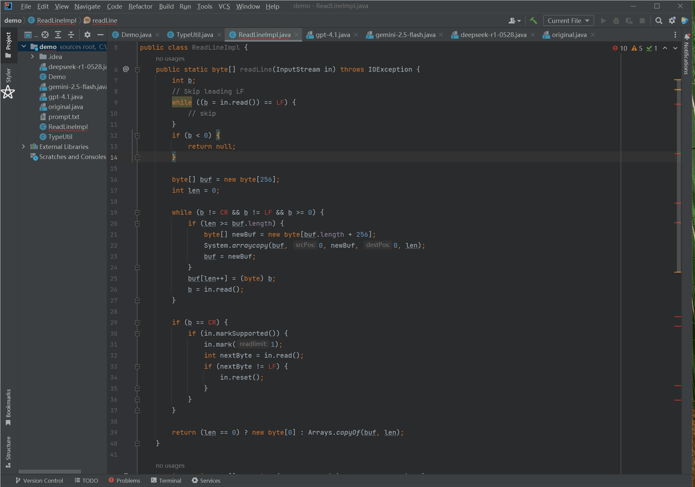

# STYLEX

## 📂 Directory Structure
```text
STYLEX
├── README.md
├── STYLEX
├── plugin
├── evaluation
│   ├── data
│   ├── human-study
│   ├── meta-data
│   ├── raw-data
│   └── src
└── paper-supplement
```
+ `STYLEX`: source code for implementing our approach and the plugin extension.  
+ `plugin`: the plugin extension. 
+ `evaluation`  
    + `data`: transferred results of all evaluated approaches.  
    + `human-study`: consistency tasks and questionnaire template used in the human study.  
    + `meta-data`: statistical information related to the construction of consistency tasks.  
    + `raw-data`: partitioned Java project datasets.  
    + `src`: source code for experiments.  
+ `paper-supplement`: supplementary materials for our paper, including tables related to `Section III` and the motivating example.


## ⚙️ Installation

1. Integrate into your project via Maven.
```xml
<dependency>
    <groupId>org.example</groupId>
    <artifactId>stylex</artifactId>
    <version>1.0.0</version>
</dependency>
```

2. **IntelliJ IDEA Plugin**  
   The IntelliJ IDEA plugin is under active development and will be released very soon.


## 🚀 Usage
1. Command line args
```text
Usage:
-src <arg> -target <arg> [-f/-d <arg>] [-so <arg>] [-c/--check]
-target <arg> -so <arg> [-c/--check]

Options:
 -src <arg>              Source file or directory path.
 -target <arg>           Target file/directory path or target style file path.
 -f <arg>                Output file path for transformed code.
 -d <arg>                Output directory path for transformed code 
                         (the file name remains unchanged).
 -so, --style-out <arg>  Output path for the generated style file (optional).
 -c, --check             Perform style checking only.

```

2. Intellij IDEA plugin
The documentation for our IntelliJ IDEA plugin will be released together with the plugin.


## 🎬 Plugin Demo
We demonstrate two operations:
1. select an entire directory as the reference code -> File-level style transfer
2. select a code snippet as the reference style -> Snippet-level style transfer (supporting function-level and statement-level granularity)


